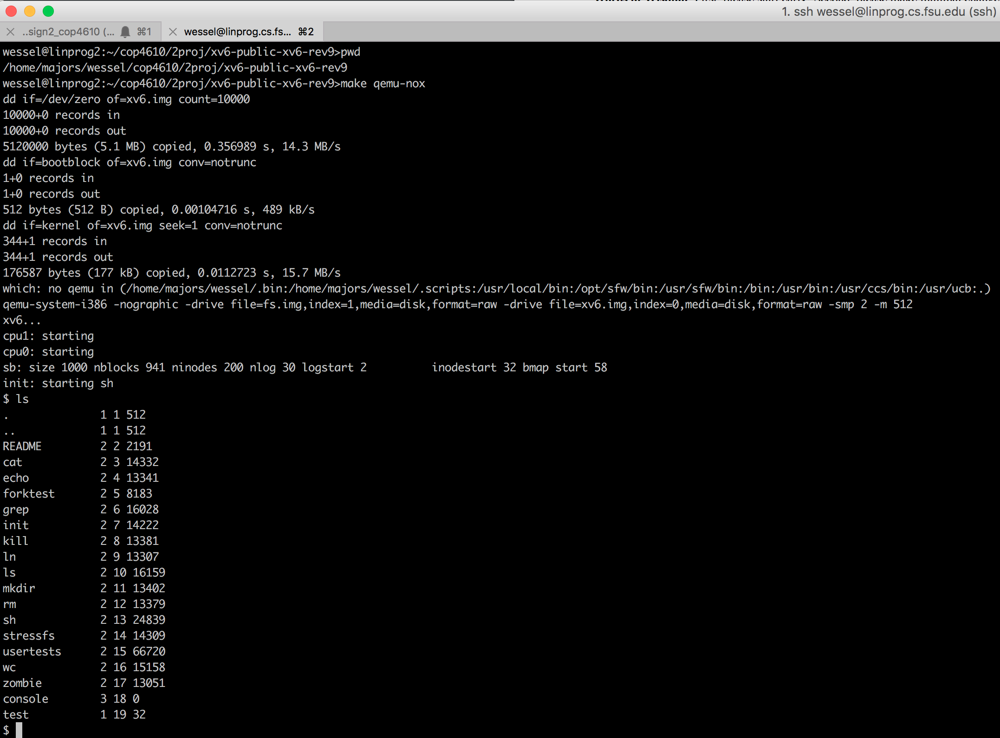

# xv6-systemcall
# Part 1: xv6 on QEMU
1. Download the tar file from here: https://campus.fsu.edu/bbcswebdav/pid-8463098-dt-content-rid-50739172_2/xid-50739172_2
2. Extract the tar file
3. scp the executed files to linprog
    - scp -r xv6-public-xv6-rev9 'username'@linprog.cs.fsu.edu:/home/majors/'username'/'project directory'
4. ssh into linprog and navigate to /'project directory'
5. Run 'make' to create xv6.img
6. Run 'make qemu-nox' to run xv6 on linprog

<p align="center">
  
</p>

# Part 2: The Life of getpid
- To assist with executing a user program line getpid() I followed the professors YouTube video where he created mytest1.c to directly call getpid() and return the pid number.

## User Space
- getpid() is executed from a user program in the userspace
```javascript
void
getpid_test(void)
{
  int ppid;

  ppid = getpid();                          // mytest1.c executes getpid() in the userspace
  printf(1, "getpid_test = %d\n", ppid);
}
```
- getpid is declared in user.h
```javascript
int getpid(void);
```
- getpid is defined in usys.S
- SYSCALL(getpid) which expands to:
```javascript
.globl getpid;			# declares getpid as a global symbol
  getpid:			# entry point of getpid
    movl $SYS_getpid, %eax;   # put system call number in eax register
    int $T_SYSCALL; 		# trigger software interrupt, enter kernel
    ret;				# return result to the caller of close
```
	
- $SYS_close defined in syscall.h
```javascript
#define SYS_getpid 11 
```
- $T_SYSCALL defined in traps.h

## Kernel
-	int $T_SYSCALL; 	#triggers software interrupt
-	CPU pauses, and asks the interrupt handler to take over
-	Interrupt handler is vector of 64 found in traps.h
```javascript
#define T_SYSCALL       64      // system call
```
-	vectors.S sends all jumps to alltraps function in trapasm.S
-	alltraps creates the trapframe and calls
-	trap(struct trapframe *tf) in trap.c
-	struct trapframe in x86.h saves the userspace registers and the tf->eax contains the system call number for SYS_getpid
```javascript
//PAGEBREAK: 36
// Layout of the trap frame built on the stack by the
// hardware and by trapasm.S, and passed to trap().
struct trapframe {
// registers as pushed by pusha
uint edi;
uint esi;
.
.
.
```
Syscall Dispatch
-	trap(struct trapframe *tf) in trap.c calls syscall(void) because tf->trapno == T_SYSCALL
-	trapframe is saved to the process control block
-	After trapframe returns, trap() returns to alltraps
-	Restores the user registers
-	Returns back to the user space with iret
-	sysproc() reads the sysproc number in eax, and calls sys_getpid
-	sys_getpid is defined in sysproc.c
-	Return value saved in proc->pid;
-	Control is returned to trap
-	sys_getpid in sysproc.c returns the integer value of the pid

# Part 3: pstree

## Quickstart
- cd into xv6 directory
- Run the following commands:
```javascript
make
make qemu-nox
// this will start xv6, now run pstree within xv6
$ pstree
init[0]
  sh[4]
    pstree[7]
  sh[5]
    usertests[6]
    cat[8]
```

## Description
- Implement a small subset of the pstree function in xv6.

## Documentation
- Interface was declared in user.h
```javascript
// getprocs interface
int getprocs(int max, struct uproc*);
```

- Struct uproc was defined and declared in uproc.h
```javascript
struct uproc {
    int pid;
    int ppid;
    char name[16];
};
```

- System call SYS_getprocs was declared in syscall.h
```javascript
#define SYS_getprocs 22
```

- Implementation of sys_getprocs was done in sysproc.c
```javascript
int
sys_getprocs(void){
.
.
.
}
```
- Definition, declaration, and implemenation of pstree command is in pstree.c